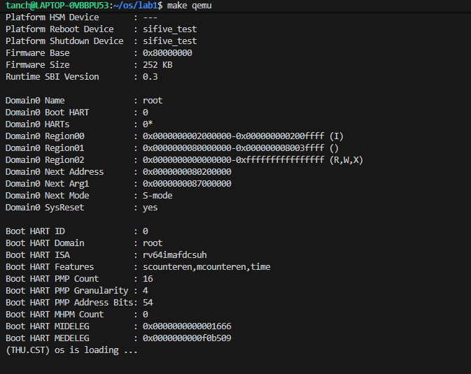
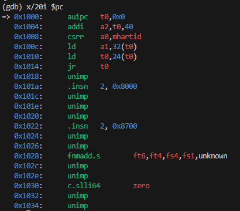
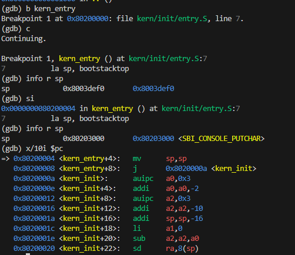

# 操作系统实验报告

## 实验基本信息

| 项目 | 内容 |
|------|------|
| **实验名称** | Lab 1: 最小可执行内核实验 |
| **小组成员** | 2413073-唐涵城、2413576-林泽森、2413523-尤祺乐 |
| **完成日期** | 2026-10-07 |

### 小组分工

| 成员 | 负责的练习/模块 |
|------|----------------|
| 2413073-唐涵城 | 练习1：理解内核启动中的程序入口操作 |
| 2413576-林泽森 | 练习2：使用 GDB 验证启动流程 |
| 2413523-尤祺乐 | 实验报告整理、测试截图与验证 |

**实验报告分工：**

- 唐涵城：撰写练习1分析，整理 `entry.S` 相关知识点。
- 林泽森：撰写练习2调试过程，记录 GDB 观察结果与问题回答。
- 尤祺乐：汇总报告，插入测试截图，统一格式，撰写实验总结与 AI 协作经验。
- 全体成员：分别针对练习1、练习2撰写个人感悟。

---

## 一、实验目的

本实验的主要目的是：

1. 理解 QEMU 模拟的 64 位 RISC-V 计算机的启动流程，掌握从加电复位到内核第一条指令执行的完整过程。
2. 学习使用链接脚本描述内存布局，进行交叉编译生成内核镜像，并使用 OpenSBI 作为 bootloader 加载内核。
3. 掌握使用 OpenSBI 提供的服务在屏幕上格式化打印字符串，为后续调试打下基础。
4. 熟悉 QEMU 与 GDB 联合调试的方法，能够跟踪 RISC-V 从加电到跳转内核入口的整个过程。

---

## 二、实验环境

你们使用的 AI 工具

| 成员 | AI 编程工具 | 底层模型 | 备注 |
|------|------------|---------|------|
| 2413073-唐涵城 | Deepseek 网页版 | Deepseek v4.1Flash |      |
| 2413576-林泽森 | Deepseek 网页版 | Deepseek v4.1Flash | |
| 2413523-尤祺乐 | Deepseek 网页版 | Deepseek v4.1Flash | |

**说明：**
- **AI 编程工具**：指具体使用的终端工具、编辑器插件、桌面应用或浏览器界面
- **底层模型**：指该工具使用的大语言模型及版本

---

## 三、实验整体逻辑分析

### 2.1 本章节的逻辑主线

本章围绕**最小可执行内核的启动流程**展开。核心问题是：一个操作系统内核从加电到执行第一条 C 语言指令，中间经历了哪些阶段？具体包括：QEMU 复位后如何进入 OpenSBI，OpenSBI 如何加载内核镜像到 `0x80200000`，以及内核入口 `entry.S` 如何设置栈并跳转到 `kern_init()`。

整个实验解决的是“内核如何被正确加载并运行”的问题，为后续实验（内存管理、中断处理、进程调度等）提供一个可运行的最小基础。

### 2.2 功能的逐步实现

本章实验按照以下顺序逐步实现：

1. **理解链接脚本与内存布局** → 首先通过 `tools/kernel.ld` 指定内核加载地址为 `0x80200000`，这是内核能够被 OpenSBI 正确加载的前提。
2. **交叉编译生成内核镜像** → 使用 RISC-V 交叉工具链将 `kern/init/entry.S` 和 `kern/init/init.c` 编译链接为 `bin/kernel`，再通过 `objcopy` 生成 `bin/ucore.img`。
3. **使用 OpenSBI 加载内核** → QEMU 内置 OpenSBI 固件，负责初始化 M 模式环境，并将内核加载到 `0x80200000`。
4. **内核入口执行** → `entry.S` 设置内核栈指针 `sp`，然后通过 `tail kern_init` 跳转到 C 语言入口 `kern_init()`。
5. **输出信息** → `kern_init()` 调用 `cprintf()` 输出启动信息，验证内核成功运行。

---

## 四、实验内容与实现

### 练习1：理解内核启动中的程序入口操作

**负责人：** 2413073-唐涵城

#### 模块功能描述

**需要实现/修改的函数：**

```asm
# kern/init/entry.S
la sp, bootstacktop
tail kern_init
```

**功能说明：**

`entry.S` 是 OpenSBI 跳转到内核后执行的第一段代码。它位于链接脚本`loader`指定的 `.text.kern_entry` 段，被放置在 `0x80200000` 处。这段代码的主要任务是：

1. 设置内核栈指针，为 C 语言函数调用准备栈空间。
2. 跳转到 C 语言编写的 `kern_init()` 函数。

#### 最终提示词

以下是经过迭代优化后，最终成功实现该功能的提示词：

```
请阅读 kern/init/entry.S 中的以下代码：
la sp, bootstacktop
tail kern_init

结合 RISC-V 调用约定和操作系统内核启动流程，解释：
1. la sp, bootstacktop 完成了什么操作？目的是什么？
2. tail kern_init 完成了什么操作？目的是什么？
3. 为什么需要先设置栈指针，再跳转到 C 函数？
```

#### 实现迭代过程

本模块的实现经历了 1 次迭代，过程如下：

##### 第一次迭代

**最终结果：**

经过分析，该模块最终：

- ✅ 理解 `la sp, bootstacktop` 的作用：将 `bootstacktop` 的地址加载到栈指针 `sp`，设置内核栈。
- ✅ 理解 `tail kern_init` 的作用：跳转到 `kern_init()`，且不返回（尾调用）。
- ✅ 明确了 C 语言运行需要栈空间，因此必须在调用 C 函数前设置 `sp`。

**关键改进点总结：**

1. 明确了 `bootstacktop` 是内核栈的顶部地址，栈向低地址增长。
2. 理解了 `tail` 伪指令等价于 `j kern_init`，但会遵循调用约定，不保存返回地址。

------

### 练习2：使用 GDB 验证启动流程

**负责人：**2413576-林泽森

#### 模块功能描述

**需要实现/修改的函数：**

无代码修改，使用 GDB 调试 QEMU 模拟的 RISC-V 启动流程。

**功能说明：**

通过 GDB 连接 QEMU 的调试端口，跟踪从加电复位到内核第一条指令的完整过程，验证 OpenSBI 加载内核并跳转到 `0x80200000`。

#### 最终提示词

以下是经过迭代优化后，最终成功实现该功能的提示词：

```markdown
请描述如何使用 GDB 跟踪 QEMU 模拟的 RISC-V 从加电到执行内核第一条指令的过程。
包括：
1. 如何启动 QEMU 并开启 GDB 调试？
2. 如何在 GDB 中设置断点、单步执行、查看寄存器和内存？
3. RISC-V 硬件加电后最初执行的几条指令位于什么地址？它们主要完成了哪些功能？
4. 如何验证内核被加载到 0x80200000？
```

#### 实现迭代过程

本模块的实现经历了 1 次迭代，过程如下：

##### 第一次迭代

**遇到的问题：**

- 问题1：第一次`make qemu`发现并没有打印，即没有执行到`kern_init()`函数位置
- 问题2：直接单步执行 OpenSBI 代码时，地址反复循环，无法快速到达内核入口。
- 问题3：GDB 显示 `??`，没有符号信息。

**问题解决策略：**

- 针对问题1：由于 `qemu-system-riscv64` 模拟器的版本问题（本人电脑上是 7.0.0），原 `Makefile` 中 `qemu` 和 `debug` 目标使用的 `-device loader,file=$(UCOREIMG),addr=0x80200000` 选项，其本质只是把编译后的镜像写入内存 `0x80200000` 处，并不会通知 OpenSBI “启动后应当跳转到 `0x80200000` 执行”。在新版 QEMU 中，OpenSBI 从 `fw_dynamic_info` 结构体里读到的下一阶段入口地址为 `0`，于是跳转到 `0x0`，导致内核根本没有被执行。

  因此，需要将该选项替换为 `-kernel $(UCOREIMG)`。QEMU 的 `-kernel` 选项在加载纯二进制时，会按照 RISC-V `virt` 平台的默认约定，把镜像加载到 `0x80200000`，同时把内核入口地址写入 `fw_dynamic_info`，告诉 OpenSBI 启动后跳转到该地址。这样 OpenSBI 才能正确地把控制权交给内核，`kern_init()` 才会被执行。

- 针对问题2：不在 OpenSBI 阶段单步，而是直接设置断点 `b *0x80200000`，然后 `continue`，让 OpenSBI 自行运行。

- 针对问题3：`??` 是因为 OpenSBI 没有调试符号，属于正常现象。

**最终结果：**

经过调试，该模块最终：

- ✅ 成功使用 GDB 连接到 QEMU。
- ✅ 观察到 CPU 从 `0x1000` 开始执行，跳转到 `0x80000000`（OpenSBI）。
- ✅ 通过 `b *0x80200000` 成功在内核入口处中断。
- ✅ 验证了内核确实被加载到 `0x80200000`。

**调试过程记录：**

1. 启动 QEMU 调试：

   ```bash
   make debug
   ```

2. 另开终端连接 GDB：

   ```bash
   make gdb
   ```

3. 在 GDB 中设置断点：

   ```bash
   b *0x80200000
   c
   ```

4. 观察结果：

   - 初始 PC 为 `0x1000`。
   - 执行几条指令后跳转到 `0x80000000`（OpenSBI）。
   - 继续运行后，断点命中 `0x80200000`，即 `kern_entry`。

5. 查看寄存器：

   ```bash
   i r sp pc
   ```

   确认 `pc = 0x80200000`，`sp` 已被设置为 `bootstacktop`。

**问题回答：**

- **RISC-V 硬件加电后最初执行的几条指令位于什么地址？**
  位于 `0x1000`，这是 QEMU 的复位向量地址。
- **它们主要完成了哪些功能？**
  复位向量处的代码负责初始化最基本的硬件环境，将 hart ID 放入 `a0`，设备树地址放入 `a1`，然后跳转到 OpenSBI 的入口 `0x80000000`。

---

## 五、测试与验证

- 编译及运行成功的输出（make qemu）
- 使用`gdb`对加电到执行`kern_init`中间查询汇编代码
- 使用`gdb`对`kern_entry`处进行断点观察

**测试截图：**

```bash
make qemu
```



观察到成功执行，最终输出`kern_init()`函数中的打印字符串，并且最终进入死循环。


```bash
make debug

make gdb
x/20i $pc
```



观察到加电开始阶段前20条反汇编代码，在这个过程中，OpenSBI主要是负责初始化最基本的硬件环境，将 hart ID 放入 `a0`，设备树地址放入 `a1`。而OpenSBI在加电到执行内核代码中间执行了几万甚至几十万条汇编代码，最后会跳转到 OpenSBI 的入口 `0x80000000`，执行我们给他的内核代码。


```bash
终端1：
make debug

终端2：
make gdb
b kern_entry
c
info r sp
si 
info r sp
x/10i $pc
```



通过对`kern_entry`打断点，可以发现其第一条指令是`la sp, bootstacktop`，目的是将栈顶指针地址赋值给`sp`，完成栈的初始化操作。随后的代码是`tail kern_init`，即进入`kern_init()`函数。

---

## 六、实验总结与收获

### 对操作系统的理解

1. **链接脚本与内存布局**：链接脚本 `kernel.ld` 指定了内核的加载地址 `0x80200000`，这是内核能够被 OpenSBI 正确加载并执行的基础。OS 原理中，内存布局决定了程序的加载和运行方式。
2. **交叉编译与工具链**：使用 `riscv64-unknown-elf-gcc` 进行交叉编译，生成 RISC-V 可执行文件。这体现了操作系统开发中“宿主机-目标机”分离的常见模式。
3. **启动流程与固件**：OpenSBI 作为 M 模式固件，负责初始化硬件并加载 S 模式内核。这与现代 PC 中 UEFI → 引导程序 → 操作系统的三级跳类似。
4. **内核栈与 C 运行环境**：`entry.S` 设置栈指针后跳转到 C 函数，说明了 C 语言运行需要栈空间，这是操作系统启动时必须首先完成的工作。

### AI 协作开发的经验

在与 AI 协作过程中，我们体会到：

- AI 可以帮助快速理解汇编代码和启动流程，但需要结合具体实验环境验证。
- 对于 GDB 调试，AI 能提供调试思路，但实际断点位置和观察结果仍需自己操作确认。
- 报告整理时，AI 能帮助组织内容，但实验细节和问题分析必须基于真实操作。


### 个人感悟

#### 2413073-唐涵城

**对练习1的感悟：**
练习1让我第一次认真阅读了 `entry.S` 这样贴近硬件的汇编代码。以前总觉得操作系统启动很神秘，但看到 `la sp, bootstacktop` 和 `tail kern_init` 这两条指令后，我明白了内核在跳转到 C 语言之前，必须先建立栈环境。这让我意识到，高级语言并不是凭空运行的，它背后需要汇编层做好最基础的准备。另外，`tail` 伪指令的尾调用特性也让我对 RISC-V 的调用约定有了更具体的认识。

**对练习2的感悟：**
练习2的 GDB 调试让我印象很深。一开始我尝试从 `0x1000` 单步跟踪，结果在 OpenSBI 里绕来绕去，地址反复循环，完全看不到自己的代码。后来学会直接 `b *0x80200000` 再 `continue`，才顺利停在 `kern_entry`。这让我体会到调试要讲究策略，不能蛮干。同时，看到 PC 真的从 `0x1000` 一路走到 `0x80200000`，对“固件 → 引导程序 → 内核”的接力过程有了直观感受。

**总体感悟**

通过这次练习的学习，我认识到了电脑的启动过程，包括从开机到执行一段存储在ROM 中的固件代码，再到固件加载引导程序，最后引导程序加载操作系统内核的完整链条。针对RISC-V架构的电脑，OpenSBI就是这样的引导程序，其出现的目的核心就是隔离，M 权限即机器模式（Machine Mode），是 RISC-V 中权限最高的特权级，可以直接访问所有硬件资源；而操作系统内核通常运行在 S 权限即监管者模式（Supervisor Mode），权限低一级。OpenSBI 运行在 M 模式，负责初始化时钟、中断控制器、串口等底层硬件，并通过 SBI向 S 模式的内核提供统一的服务接口。这样内核就不需要直接操作硬件细节，只需要调用 OpenSBI 提供的服务即可，既简化了内核开发，又实现了硬件与操作系统的解耦。

在我们的实验中，`kern_init()` 调用 `cprintf()` 输出信息，最终就是通过 SBI 的 `console_putchar` 服务把字符送到 QEMU 的串口上。这也让我意识到，操作系统并不是直接和硬件打交道的，中间往往有一层固件或抽象层来屏蔽差异，这种分层设计的思想在计算机系统中非常普遍。从 QEMU 的 `virt` 平台到真实的 RISC-V 开发板，只要 OpenSBI 提供的 SBI 接口一致，内核就可以在两者之间移植。这次实验让我不仅理解了启动流程，也初步体会到了操作系统设计中“抽象”和“分层”的重要性。

如何使像操作系统这样的程序运行在 OpenSBI 上呢？首先，通过交叉编译器将源码编译成目标文件，再由链接器按照链接脚本 `kernel.ld` 把内核的加载基址指定为 `0x80200000`，生成 ELF 文件。然后，用 `objcopy` 把 ELF 转换成纯二进制文件 `ucore.img`，去掉 ELF 头和符号表。接着，通过 QEMU 的 `-kernel` 选项，在启动前把该镜像加载到内存 `0x80200000` 处。同时，QEMU 会把内核入口地址写入 `fw_dynamic_info` 结构体，OpenSBI 读取后据此跳转到 `0x80200000`，把控制权交给内核。

通过本次实验，我理解了 RISC-V 从加电、OpenSBI 初始化到内核执行的完整启动流程，掌握了链接脚本、交叉编译、`objcopy` 和 QEMU `-kernel` 的配合机制，也体会到固件与操作系统之间通过 SBI 解耦的分层设计思想。

#### 2413576-林泽森

**对练习1的感悟：**
我负责的是练习2，但为了写报告也认真看了练习1。`entry.S` 虽然只有两行，但信息量很大。`bootstacktop` 是链接脚本里定义的符号，`la` 把它加载到 `sp`，栈向低地址增长，这些细节让我对链接脚本和内存布局的关系有了更具体的理解。以前写 C 程序从没关心过栈是谁设置的，现在知道内核启动时必须自己设置栈，否则 C 函数根本无法运行。

**对练习2的感悟：**
练习2是我主要负责的部分。通过 GDB 连接 QEMU，我学会了如何设置断点、单步执行、查看寄存器和内存。最大的收获是理解了 `-s -S` 参数的作用：`-s` 开启 GDB 服务器，`-S` 让 CPU 启动时暂停。另外，OpenSBI 阶段的 `??` 和循环也让我明白，调试固件和调试内核是两回事，要善于利用断点跳过不关心的部分。这次调试让我对 RISC-V 的启动流程有了非常直观的认识。

#### 2413523-尤祺乐

**对练习1的感悟：**
我主要负责测试和报告整合，但我也自行尝试分析了`entry.S`。`entry.S`中在对齐内存页后，留出了`KSTACKSIZE`字节的空间并用符号`bootstacktop`标记了位置，这段空间就相当于内核的栈，而`bootstacktop`所在的位置就是栈顶，因为栈从高地址向低地址增长。而`la sp, bootstacktop`指令就是将栈顶的地址加载到充当栈指针的寄存器。这个过程就是分配了栈的空间并初始化了栈指针。然后，指令`tail kern_init`等价于跳转到定义于文件`init.c`的C函数`kern_init()`所在的位置，此后内核的运行由函数`kern_init()`接管。总而言之，`entry.S`充当了初始化的作用，其功能为初始化内核的栈并跳转到编写好的内核初始化函数。这段代码作为运行在几乎裸机上的程序（即内核）的入口是不可或缺的。

**对练习2的感悟：**
练习2主要考验使用gdb的能力。先使用命令`si`逐条执行，发现寄存器PC从0x1000跳转到0x1010后，即跳转到0x80000000，即OpenSBI的入口。那么0x1000到0x1010应当就是初始化OpenSBI的指令。使用命令`x/20i 0x1000`即可阅读对应的汇编，对应汇编代码将起点0x1000加载到t0，将设备树地址(t0+32)加载到a1，hart id加载到a0，然后将(t0+24)处存储的数字加载到t0，即OpenSBI的入口地址，随后跳转到t0，进入OpenSBI。
